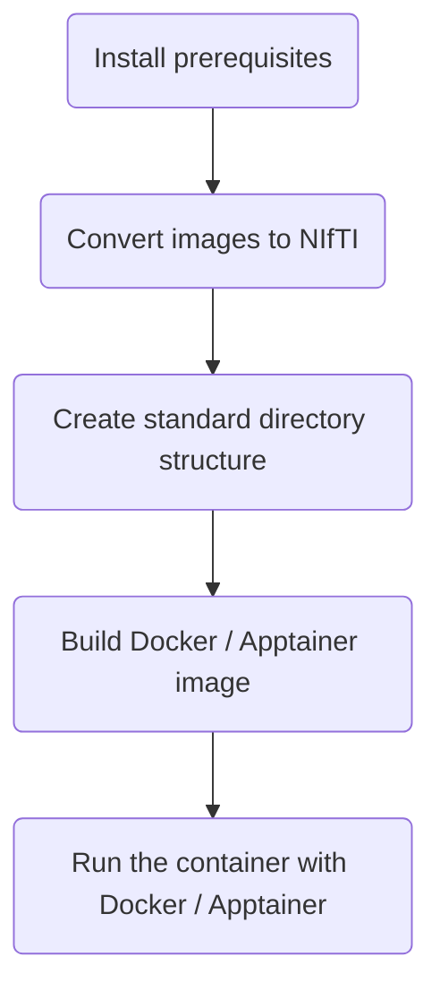

# Enigma-PD-WML

Segment White Matter Lesions (WML) in T1-weighted and FLAIR MRI images using FSL and U-Net

## What does the pipeline do?

This pipeline allows white matter lesions (WMLs) to be segmented from a subject's T1-weighted and FLAIR MRI images from
the same scanning session. The analysis steps (including pre- and post- processing) make use of the following tools:

- [FSL (FMRIB Software Library)](https://fsl.fmrib.ox.ac.uk/fsl/docs/) : a library of analysis tools for FMRI, MRI and
  diffusion brain imaging data.

- [UNet-pgs](https://www.sciencedirect.com/science/article/pii/S1053811921004171?via%3Dihub) : A segmentation pipeline
  for white matter hyperintensities (WMHs) using U-Net.

- [MRIcroGL](https://www.nitrc.org/projects/mricrogl) : A tool for converting DICOM images to NIfTI format.

The pipeline is available as a [Docker](https://www.docker.com/) or [Apptainer](https://apptainer.org/) container,
allowing it to be run on many different systems.

## How to run the pipeline?

Setting up and running the pipeline requires the following steps, which are explained in detail in the sections below:



## 1. Install prerequisites

If your MRI data isn't in NIfTI format, download [MRIcroGL from their website](https://www.nitrc.org/projects/mricrogl).

If you want to run the container via Docker, install [Docker Desktop](https://docs.docker.com/get-started/get-docker/).
They have installation instructions for [Mac](https://docs.docker.com/desktop/install/mac-install/),
[Windows](https://docs.docker.com/desktop/install/windows-install/) and
[Linux](https://docs.docker.com/desktop/install/linux-install/) systems.

If you want to use Apptainer instead, then follow the
[installation instructions on their website](https://apptainer.org/docs/user/main/quick_start.html).

## 2. Convert images to NIfTI format (if required)

If your images aren't in NIfTI format, you can use [MRIcroGL](https://www.nitrc.org/projects/mricrogl) to convert them.

Open MRIcroGL and select `Import > Convert DICOM to NifTI`


Set the the output file format to `%i_%p` to include the patient ID and series description in the filename.


You can then drag/drop DICOM files and folders onto the right side of the window to convert them. Alternatively, you can
click the `Select Folder To Convert` button (at the bottom of the left side of the window) to select a folder to convert
directly.

## 3. Create standard directory structure

Create a directory (anywhere on your computer) to hold your input image data and the generated results.

Inside this directory:

- Create `code` and `data` directories. The `code` folder should remain empty.

- Inside the `data` folder, create a `subjects.txt` file that contains subject identifiers (one per line) e.g. these
  could be numeric subject ids.

- For each subject id:
  - Create a directory at `data/subject-id` (replacing 'subject-id' with the relevant id from your `subjects.txt` file)

  - Create a sub-directory inside the 'subject-id' directory called `niftis`.

  - Inside `niftis` place the subject's T1 MRI scan and FLAIR MRI scan. Both these files should be in nifti format
  (ending `.nii.gz`) and contain either `T1` or `FLAIR` in their name respectively.

Your final file structure should look like below (for two example subject ids):

```bash
Enigma-PD-WML
│
├───code
│
└───data
    ├───subject-1
    │   └───niftis
    │       ├───T1.nii.gz
    │       └───FLAIR.nii.gz
    │
    ├───subject-2
    │   └───niftis
    │       ├───T1.nii.gz
    │       └───FLAIR.nii.gz
    └───subjects.txt
```

## 4. Build the Docker / Apptainer image

To build the image (in Docker or Apptainer), you have the following options:

- Use the image from Docker Hub
- Build the image from source

### Using the image from docker hub

The image is available on docker hub in the
[enigma-pd-wml repository](https://hub.docker.com/r/hamiedaharoon24/enigma-pd-wml/tags).

If you want to run the container via docker, you can download it by running:

```bash
docker pull hamiedaharoon24/enigma-pd-wml:latest
```

If you want to run the container via Apptainer instead, use:

```bash
apptainer build enigma-pd-wml.sif docker://hamiedaharoon24/enigma-pd-wml:latest
```

### Build the image from source

Clone this github repository with:

```bash
git clone https://github.com/UCL-ARC/Enigma-PD-WML.git
```

Build the Docker image with:

```bash
cd Enigma-PD-WML
docker build -f Dockerfile -t enigma-pd-wml .
```

If you want to run the container via Apptainer, you can convert this Docker image into an Apptainer one via:

```bash
docker image save enigma-pd-wml -o enigma-pd-wml.tar
apptainer build enigma-pd-wml.sif docker-archive:enigma-pd-wml.tar
```

## 5. Run the container

Below are various ways to run the container. For each, make sure you run the command from the top level of the
directory you made in the ['Create standard directory structure' section](#3-create-standard-directory-structure).
Note [there are some options](#options) you can add to the end of the docker/apptainer command.

If you encounter issues when running the pipeline, check the [output logs](#output-logs) for any errors.

### Via docker (using image from docker hub)

```bash
docker run -v "$(pwd)":/home -v "$(pwd)"/code:/code -v "$(pwd)"/data:/data hamiedaharoon24/enigma-pd-wml
```

### Via docker (using image built from source)

```bash
docker run -v "$(pwd)":/home -v "$(pwd)"/code:/code -v "$(pwd)"/data:/data enigma-pd-wml
```

### Via apptainer

You'll need to put the `.sif` file in the top level of the directory you made in the
['Create standard directory structure' section](#3-create-standard-directory-structure), or provide the full path to
its location.

```bash
apptainer run --bind ${PWD}:/home --bind ${PWD}/code:/code --bind ${PWD}/data:/data enigma-pd-wml.sif
```

### Options

- `-n` : the number of jobs to run in parallel.

  By default (without `-n`), the pipeline will process your subjects sequentially on 1 core. With `-n` they will be
  processed in parallel with `n` jobs. For example:

  ```bash
  # Run with 5 jobs
  -n 5
  ```

  A good default value is the number of cores on your system, but be
  [wary of increased memory usage](#tensorflow-memory-usage).

- `-o` : whether to overwrite existing output files

  By default (without `-o`), the pipeline will try to re-use any existing output files, skipping steps that are already
  complete. This is useful if, for example, the pipeline fails at a late stage and you want to run it again, without
  having to re-run time-consuming earlier steps. With `-o` the pipeline will run all steps again and ensure any previous
  output is overwritten.

## Pipeline output

### Output images

The main pipeline output will be written to a zip file (per subject) at
`/data/UNet-pgs/subject-id/subject-id_results.zip`

This should contain six files within an `output` directory:

- `results2mni_lin.nii.gz`: WML segmentations linearly transformed to MNI space.

- `results2mni_lin_deep.nii.gz`: WML segmentations (deep white matter) linearly transformed to MNI space.

- `results2min_lin_perivent.nii.gz`: WML segmentations (periventricular) linearly transformed to MNI space.

- `results2mni_nonlin.nii.gz`: WML segmentations non-linearly transformed to MNI space.

- `results2min_nonlin_deep.nii.gz`: WML segmentations (deep white matter) non-linearly transformed to MNI space.

- `results2mni_nonlin_perivent.nii.gz`: WML segmentations (periventricular) non-linearly transformed to MNI space.

### Output logs

Pipeline logs can be found at:

- `/code/overall_log.txt`: contains minimal information about the initial pipeline setup.

- `/code/subject_logs`: one log per subject, containing information about the various processing steps.

## Common issues

### Tensorflow memory usage

A common issue is UNets-pgs failing due to high memory usage. You may see warnings / errors in your subject logs
similar to:

- `tensorflow/core/framework/allocator.cc:124] Allocation of 675840000 exceeds 10% of system memory.`

- `/WMHs_segmentation_PGS.sh: line 14: 69443 Killed`

You may want to try:

- Running the pipeline on a system with more memory

- Reducing the number of jobs passed to the `-n` option (if you're using it). This will slow down the pipeline, but
  also reduce overall memory usage.
