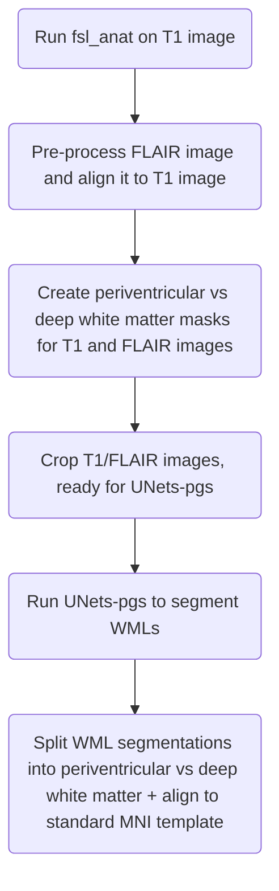

# Enigma-PD-WML pipeline details

All processing steps are called via a [bash script `analysis_script.sh`](../analysis_script.sh)

This processes each subject's T1-weighted and FLAIR MRI images with the following main steps (each is a separate
function in the bash script):

## fsl_anat

First, FSL's `fsl_anat` tool is run on the input T1 image and its output saved to
`/code/Controls+PD/subject-id/input/t1-mni.anat`.

[See FSL's documentation](https://fsl.fmrib.ox.ac.uk/fsl/docs/#/structural/fsl_anat) for details of the various
processing steps this includes.

## FLAIR preparation

Next, various FSL tools are used to pre-process the input FLAIR image and align it to the T1 image. Results are written
to `/code/Controls+PD/subject-id/input/flair-bet`. This includes steps to:

- Re-orient the FLAIR image to the standard (MNI) orientation with `fslreorient2std`

- Extract the brain with [`bet` (brain extraction tool)
  ](https://fsl.fmrib.ox.ac.uk/fsl/docs/#/structural/bet?id=bet-brain-extraction-tool)

- Register the FLAIR image to the field-bias-corrected T1 brain (`T1_biascorr_brain`) from `fsl_anat` using
  [`flirt` (FMRIB's Linear Image Registration Tool)](https://fsl.fmrib.ox.ac.uk/fsl/docs/#/registration/flirt/index)

- Apply this transformation to the reoriented FLAIR image using `flirt`

## Ventricular distance mapping

Next, various FSL tools are used to create periventricular vs deep white matter masks for both the T1 and FLAIR images.
These will be used at a later stage to divide WML segmentations into periventicular vs deep white matter. Results are
written to `/code/Controls+PD/subject-id/input/vent_dist_mapping`.

This includes steps to:

- create binary masks of the ventricles and white matter with
  [`make_bianca_mask`](https://fsl.fmrib.ox.ac.uk/fsl/docs/#/structural/bianca)

- Align these masks with the FLAIR brain with `flirt`

- Use FSL's `distancemap` tool and `fslmaths` to produce the final periventricular vs deep white matter masks

## Prepare images for UNets-pgs

Next, various FSL tools are used to prepare the images for UNets-pgs. The main purpose of this step is to crop T1 /
FLAIR images with `fslroi` (if they're larger than 500 pixels in the x or y dimension).

## UNets-pgs

Run the UNet-pgs segmentation workflow. This uses the `WMHs_segmentation_PGS.sh` script from
[the pgs docker image](https://hub.docker.com/r/cvriend/pgs/tags). This will produce a WML binary segmentation mask
under `/code/Controls+PD/subject-id/output/results.nii.gz`

## Process outputs of UNets-pgs

Next, the output from UNets-pgs is processed with various fsl tools. This splits the WML segmentation from UNets-pgs
into periventricular vs deep white matter, as well as linearly/non-linearly aligning it to the standard MNI T1 1 mm
template.

This includes steps to:

- Align WML segmentations from UNets-pgs with the cropped T1 image, the full size T1 image and the full size FLAIR image
  (via `flirt`)

- Use masks from the [ventricular distance mapping step](#ventricular-distance-mapping) and `fslmaths` to divide WML
  segmentations into periventricular and deep white matter

- Linearly transform/align all segmentations with MNI T1 via `flirt`

- Non-linearly transform/align all segmentations with MNI T1 via `applywarp`

## Final pipeline outputs

The main pipeline output is then written to a zip file (per subject) at
`/data/UNet-pgs/subject-id/subject-id_results.zip`
